# code-network-gen

parses js/vue codebases and outputs function call networks as csv or gexf files. useful for understanding code structure, dependencies, and architectural patterns.

## network examples

here's what different codebases look like as network diagrams:

### code-network-gen analyzing itself 


### chance.js - utility library with many small functions

```mermaid
flowchart TD
    %% Code Network Analysis - Generated by code-network-gen
    %% Total nodes: 30, Total edges: 25

    chance_js_Chance["Chance [29-73], [29-73], [29-73] (function)"]
    chance_js_initOptions["initOptions [78-90], [78-90], [78-90] (function)"]
    chance_js_range["range [92-94], [92-94], [92-94] (function)"]
    chance_js_testRange["testRange [96-100], [96-100], [96-100] (function)"]
    chance_js_base64("base64 [105-107], [105-107], [105-107] (method)")
    chance_js_parseTemplate["parseTemplate [471-500] (function)"]
    chance_js_comparator("comparator [586-586], [393-393], [393-393] (method)")
    chance_js_checkDigit("checkDigit [1080-1101], [830-851], [830-851] (method)")
    chance_js_pad("pad [1103-1105], [853-855], [853-855] (method)")
    chance_js_generate("generate [1102-1127], [852-877], [852-877] (method)")
    chance_js_gray["gray [1461-1463], [1204-1206], [1204-1206] (function)"]
    chance_js_ukNum("ukNum [1850-1857], [1515-1522], [1515-1522] (method)")
    chance_js_comparator(["comparator [2310-2316], [1954-1960], [1954-1960] (vue-method)"])
    chance_js_name_generator("name_generator [2448-2476], [2092-2120], [2092-2120] (method)")
    chance_js_date_generator("date_generator [2477-2483], [2121-2127], [2121-2127] (method)")
    chance_js_checkdigit_generator("checkdigit_generator [2484-2501], [2128-2145], [2128-2145] (method)")
    chance_js_diceFn["diceFn [2639-2643], [2267-2271], [2267-2271] (function)"]
    chance_js__copyObject["_copyObject [11073-11081], [6868-6876], [6868-6876] (function)"]
    chance_js__copyArray["_copyArray [11083-11087], [6878-6882], [6878-6882] (function)"]
    chance_js_copyObject["copyObject [11089-11100], [6884-6895], [6884-6895] (function)"]
    test_animal_js_timeout("timeout [7-11] (method)")
    test_basic_js_timeout("timeout [7-11] (method)")
    test_normal_js_mean("mean [6-6] (method)")
    test_normal_js_stddev("stddev [7-11] (method)")
    test_person_js_ymd("ymd [23-23] (method)")
    test_person_js_age("age [25-31] (method)")
    chance_js_global>"chance.js (global) (global)"]
    test_basic_js_global>"test.basic.js (global) (global)"]
    test_normal_js_global>"test.normal.js (global) (global)"]
    test_person_js_global>"test.person.js (global) (global)"]

    %% Connections
    chance_js_global --> chance_js_initOptions
    chance_js_global --> chance_js_testRange
    chance_js_global --> chance_js_parseTemplate
    chance_js_global --> chance_js_comparator
    chance_js_global --> chance_js_range
    chance_js_global --> chance_js_pad
    chance_js_global --> chance_js_checkDigit
    chance_js_global --> chance_js_generate
    chance_js_global --> chance_js_base64
    chance_js_global --> chance_js_gray
    chance_js_global --> chance_js_ukNum
    chance_js_global --> chance_js_name_generator
    chance_js_global --> chance_js_date_generator
    chance_js_global --> chance_js_checkdigit_generator
    chance_js_global --> chance_js_diceFn
    chance_js_global --> chance_js__copyArray
    chance_js_global --> chance_js__copyObject
    chance_js_global --> chance_js_copyObject
    test_basic_js_global --> chance_js_Chance
    test_basic_js_global --> test_animal_js_timeout
    test_basic_js_global --> test_basic_js_timeout
    test_normal_js_global --> test_normal_js_mean
    test_normal_js_global --> test_normal_js_stddev
    test_person_js_global --> test_person_js_ymd
    test_person_js_global --> test_person_js_age

    %% Styling
    classDef functionClass fill:#e1f5fe,stroke:#01579b,stroke-width:2px
    classDef methodClass fill:#f3e5f5,stroke:#4a148c,stroke-width:2px
    classDef classClass fill:#fff3e0,stroke:#e65100,stroke-width:2px
    classDef vueMethodClass fill:#e8f5e8,stroke:#1b5e20,stroke-width:2px
    classDef globalClass fill:#ffebee,stroke:#c62828,stroke-width:2px
    class chance_js_Chance,chance_js_initOptions,chance_js_range,chance_js_testRange,chance_js_parseTemplate,chance_js_gray,chance_js_diceFn,chance_js__copyObject,chance_js__copyArray,chance_js_copyObject functionClass
    class chance_js_base64,chance_js_comparator,chance_js_checkDigit,chance_js_pad,chance_js_generate,chance_js_ukNum,chance_js_name_generator,chance_js_date_generator,chance_js_checkdigit_generator,test_animal_js_timeout,test_basic_js_timeout,test_normal_js_mean,test_normal_js_stddev,test_person_js_ymd,test_person_js_age methodClass
    class chance_js_comparator vueMethodClass
    class chance_js_global,test_basic_js_global,test_normal_js_global,test_person_js_global globalClass
```


### chalk - terminal styling library with focused api

```mermaid
flowchart TD
    %% Code Network Analysis - Generated by code-network-gen
    %% Total nodes: 19, Total edges: 16

    rainbow_js_rainbow["rainbow [8-27] (function)"]
    rainbow_js_animateString["animateString [29-34] (function)"]
    index_js_applyOptions("applyOptions [24-32] (method)")
    index_js_chalk("chalk [42-42] (method)")
    index_js_chalkFactory("chalkFactory [41-48] (method)")
    index_js_createChalk["createChalk [50-52] (function)"]
    index_js_getModelAnsi("getModelAnsi [74-92] (method)")
    index_js_wrapAnsi16("wrapAnsi16 [3-3] (method)")
    index_js_wrapAnsi256("wrapAnsi256 [5-5] (method)")
    index_js_wrapAnsi16m("wrapAnsi16m [7-7] (method)")
    index_js_assembleStyles["assembleStyles [73-219] (function)"]
    index_js_hasFlag["hasFlag [7-12] (function)"]
    index_js_envForceColor["envForceColor [33-45] (function)"]
    index_js_translateLevel["translateLevel [47-58] (function)"]
    index_js__supportsColor["_supportsColor [60-166] (function)"]
    index_js_createSupportsColor["createSupportsColor [168-175] (function)"]
    rainbow_js_global>"rainbow.js (global) (global)"]
    index_js_global>"index.js (global) (global)"]
    chalk_js_global>"chalk.js (global) (global)"]

    %% Connections
    rainbow_js_global --> rainbow_js_rainbow
    rainbow_js_global --> rainbow_js_animateString
    index_js_global --> index_js_applyOptions
    index_js_global --> index_js_chalkFactory
    index_js_global --> index_js_getModelAnsi
    index_js_global --> index_js_createChalk
    index_js_global --> index_js_wrapAnsi16
    index_js_global --> index_js_wrapAnsi256
    index_js_global --> index_js_wrapAnsi16m
    index_js_global --> index_js_assembleStyles
    index_js_global --> index_js_hasFlag
    index_js_global --> index_js_envForceColor
    index_js_global --> index_js__supportsColor
    index_js_global --> index_js_translateLevel
    index_js_global --> index_js_createSupportsColor
    chalk_js_global --> index_js_chalk

    %% Styling
    classDef functionClass fill:#e1f5fe,stroke:#01579b,stroke-width:2px
    classDef methodClass fill:#f3e5f5,stroke:#4a148c,stroke-width:2px
    classDef classClass fill:#fff3e0,stroke:#e65100,stroke-width:2px
    classDef vueMethodClass fill:#e8f5e8,stroke:#1b5e20,stroke-width:2px
    classDef globalClass fill:#ffebee,stroke:#c62828,stroke-width:2px
    class rainbow_js_rainbow,rainbow_js_animateString,index_js_createChalk,index_js_assembleStyles,index_js_hasFlag,index_js_envForceColor,index_js_translateLevel,index_js__supportsColor,index_js_createSupportsColor functionClass
    class index_js_applyOptions,index_js_chalk,index_js_chalkFactory,index_js_getModelAnsi,index_js_wrapAnsi16,index_js_wrapAnsi256,index_js_wrapAnsi16m methodClass
    class rainbow_js_global,index_js_global,chalk_js_global globalClass
```


### ora - simple spinner library 

```mermaid
flowchart TD
    %% Code Network Analysis - Generated by code-network-gen
    %% Total nodes: 16, Total edges: 15

    index_js_prefixText("prefixText [143-145], [147-150], [147-150] (method)")
    index_js_suffixText("suffixText [152-154], [156-159], [156-159] (method)")
    index_js_ora["ora [384-386] (function)"]
    index_js_oraPromise["oraPromise [388-422] (function)"]
    test_js_getPassThroughStream("getPassThroughStream [12-18] (method)")
    test_js_doSpinner("doSpinner [20-38] (method)")
    test_js_reset("reset [181-184] (method)")
    test_js_currentClearMethod("currentClearMethod [439-482] (method)")
    test_js_cursorAtRow("cursorAtRow [563-566] (method)")
    test_js_clearedLines("clearedLines [568-568] (method)")
    test_js_rando("rando [685-689] (method)")
    test_js_rAnDoMaNiMaLs("rAnDoMaNiMaLs [691-701] (method)")
    test_js_randos("randos [703-703] (method)")
    test_js_randomize("randomize [705-716] (method)")
    index_js_global>"index.js (global) (global)"]
    test_js_global>"test.js (global) (global)"]

    %% Connections
    index_js_global --> index_js_prefixText
    index_js_global --> index_js_suffixText
    index_js_global --> index_js_ora
    test_js_global --> test_js_getPassThroughStream
    test_js_global --> index_js_ora
    test_js_global --> test_js_doSpinner
    test_js_global --> index_js_oraPromise
    test_js_global --> test_js_reset
    test_js_global --> test_js_currentClearMethod
    test_js_global --> test_js_clearedLines
    test_js_global --> test_js_cursorAtRow
    test_js_global --> test_js_rando
    test_js_global --> test_js_rAnDoMaNiMaLs
    test_js_global --> test_js_randos
    test_js_global --> test_js_randomize

    %% Styling
    classDef functionClass fill:#e1f5fe,stroke:#01579b,stroke-width:2px
    classDef methodClass fill:#f3e5f5,stroke:#4a148c,stroke-width:2px
    classDef classClass fill:#fff3e0,stroke:#e65100,stroke-width:2px
    classDef vueMethodClass fill:#e8f5e8,stroke:#1b5e20,stroke-width:2px
    classDef globalClass fill:#ffebee,stroke:#c62828,stroke-width:2px
    class index_js_ora,index_js_oraPromise functionClass
    class index_js_prefixText,index_js_suffixText,test_js_getPassThroughStream,test_js_doSpinner,test_js_reset,test_js_currentClearMethod,test_js_cursorAtRow,test_js_clearedLines,test_js_rando,test_js_rAnDoMaNiMaLs,test_js_randos,test_js_randomize methodClass
    class index_js_global,test_js_global globalClass
```


## quick start

analyze any codebase in one command:

```bash
npx code-network-gen --path . -o my_code_network
```

that's it. creates `my_code_network_nodes.csv` and `my_code_network_edges.csv` in seconds.

## usage

```bash
code-network-gen --path <directory> [-o output_name] [-f format]
```

### options

- `--path` - directory to analyze (required)
- `-o` - output file prefix (optional, outputs to console if omitted)
- `-f, --format` - output format: `csv` (default), `gexf` (for Gephi), `graphml` (for yEd, Cytoscape), `dot` (for Graphviz), or `mermaid` (for GitHub, Notion, etc.)

### examples

analyze current directory:
```bash
code-network-gen --path .
```

analyze with csv output:
```bash
code-network-gen --path ./src -o my_project
# creates: my_project_nodes.csv, my_project_edges.csv
```

analyze with gexf output for gephi:
```bash
code-network-gen --path ./src -o my_project --format gexf
# creates: my_project.gexf (ready to open in Gephi)
```

analyze with graphml output for yed/cytoscape:
```bash
code-network-gen --path ./src -o my_project --format graphml
# creates: my_project.graphml (ready to open in yEd, Cytoscape, etc.)
```

analyze with dot output for graphviz:
```bash
code-network-gen --path ./src -o my_project --format dot
# creates: my_project.dot (ready for Graphviz tools)
```

analyze with mermaid output for documentation:
```bash
code-network-gen --path ./src -o my_project --format mermaid
# creates: my_project.mmd (ready to paste into GitHub, Notion, Obsidian, etc.)
```

## what it finds

- function declarations
- arrow functions  
- class methods
- vue component methods
- function calls and their relationships

supports: `.js`, `.jsx`, `.ts`, `.tsx`, `.vue`

## output formats

### csv format (default)

**nodes.csv**: functions and methods
```csv
id,label,type,lines
src/utils.js:formatDate,formatDate,function,[15-22]
```

**edges.csv**: function call relationships  
```csv
source,target,type
src/app.js:global,src/utils.js:formatDate,calls
```

### gexf format (for gephi)

**output.gexf**: complete network in xml format
- nodes with id, label, type, and lines attributes
- edges with source, target, and type attributes  
- ready to import directly into gephi
- includes proper xml schema and metadata

### graphml format (for yed, cytoscape)

**output.graphml**: universal graph format in xml
- nodes with id, label, type, and lines attributes
- edges with source, target, and type attributes
- compatible with yEd, Cytoscape, and other graph tools
- follows GraphML specification with proper key definitions

### dot format (for graphviz)

**output.dot**: graphviz dot format
- nodes with labels, types, and color coding
- edges with different styles based on relationship types
- compatible with dot, neato, fdp, circo, twopi, sfdp
- ready for rendering with Graphviz tools

### mermaid format (for documentation)

**output.mmd**: mermaid flowchart format
- intelligent filtering to keep diagrams readable (max 50 nodes)
- different node shapes for functions, methods, classes, vue-methods
- color-coded styling for different node types
- ready to paste into GitHub markdown, Notion, Obsidian, etc.
- renders natively in many documentation platforms

## development

```bash
git clone <repo>
npm install
npm test  # runs meta-analysis (tool analyzes itself)
npm run lint
```

## import into tools

**gephi**: 
- gexf: file → open → select the .gexf file (recommended)
- csv: file → import → choose nodes csv, then edges csv  

**yed**: file → open → select the .graphml file (recommended)

**cytoscape**: 
- graphml: file → import → network from file → select .graphml file
- csv: file → import → network from table → select both csv files  
**d3/observable**: `d3.csv()` both csv files, standard network format  
**python networkx**: 
- gexf: `nx.read_gexf('file.gexf')`
- graphml: `nx.read_graphml('file.graphml')`
- csv: `pandas.read_csv()` then `nx.from_pandas_edgelist()`  

**r igraph**: 
- gexf: `read_graph('file.gexf', format='gexf')`
- graphml: `read_graph('file.graphml', format='graphml')`
- csv: `read.csv()` then `graph_from_data_frame()`

**mermaid/documentation platforms**:
- github: paste `.mmd` content into markdown files with ` ```mermaid ` blocks
- notion: paste as mermaid diagram block
- obsidian: paste with ` ```mermaid ` code block
- gitbook: paste as mermaid diagram
- confluence: use mermaid macro with `.mmd` content

## how it works

1. walks directory tree
2. parses ast with acorn  
3. extracts function definitions and calls
4. outputs network graph as csv

that's it.